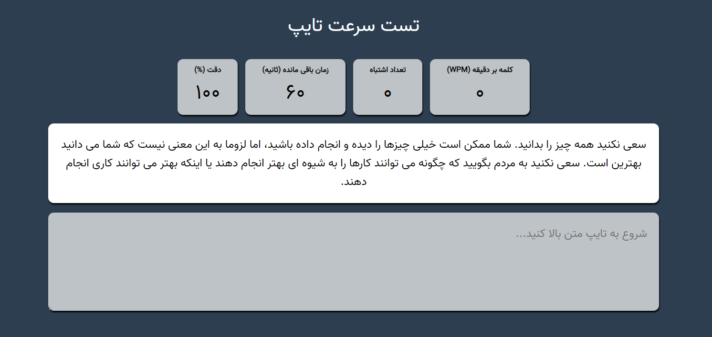

<h2 align="center">typing-test</h2>

Typing Speed Test app is to test/measure the typing speed of a user.

 
<h2></h2>

    <ul>
        <li></li>
        <li></li>
        <li></li>
    </ul>

Screenshot : 

